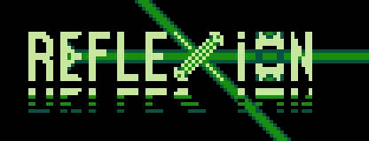

# NES-LightPuzzle-Game



A basic NES puzzle game about moving light.

-----------------

## Building the game

Just do ```make -s``` (the -s is for silent output).
Be sure to have ca65 and ld65 (<https://cc65.github.io/>)
and have the path correct in the Makefile.

-----------------

## Running the game

You can just run the .nes file with the emulator of your choice.
You can also use ```make -s run``` (don't forget to set the emulator path in Makefile).
